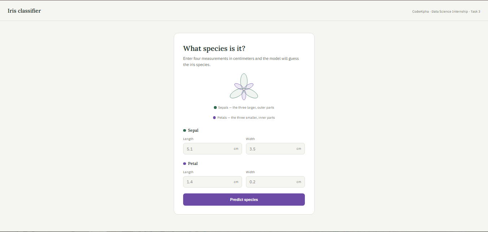
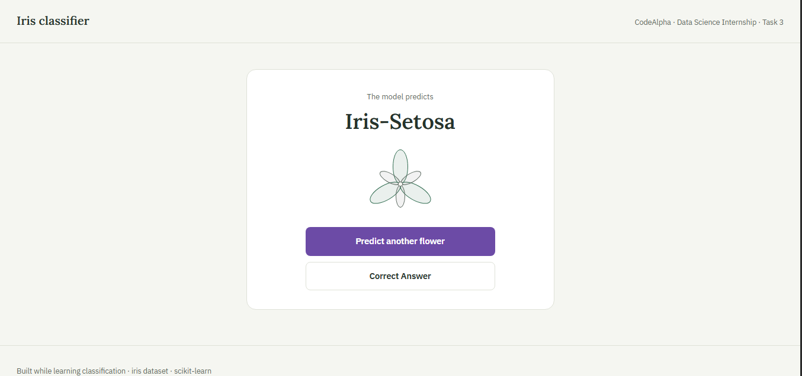
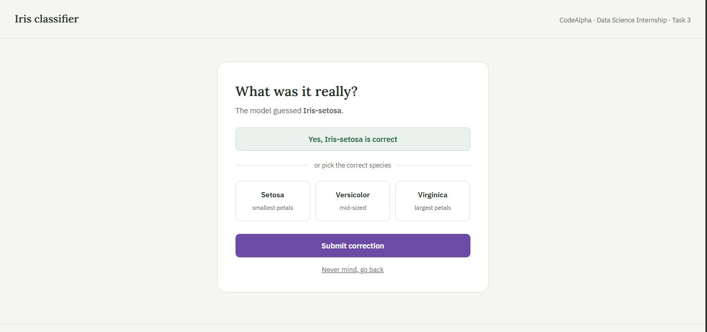

# 🌸 Iris Classification Model (End-to-End ML Project) :
## 📌 Overview :
This is a full stack end to end machine learning project , I finished it as part of my CodeAlpha Data Science internship .
In this project I applied all the knowledge and techninques I learned about classification models in machine learning . It was a really worthy hands on practice learning experience in which I improved my analytical skills as well as my model tunning skills.
While working on the project I tried to make it as professional and production ready as possible by integrating a combination of highely demanded skills such as :
- Exploratory Data Analysis.
- Data Preprocessing.
- Machine Learning Model Training.
- Finding Best Model to Best Classify new data.
- Flask web application (frontend+backend).
- Model Persistence & Serialization.
- Model Retraining (Active Learning).
- Data Storage and Smart Usage.
---
## 📸 Screenshots :



## 📋 Approach :
- Exploratory data analysis of the dataset .
- Data cleaning and preprocessing.
- Creating diffrent classification modeles , training them and then evaluating them using cross validation to find the one with best accuracy .
- Separating each step from data preprocessing to model training in a separate function inside the noebook.
- Identifying the project architecture : the project's folder structure , the frontend structure as well as the flask app's structure.
- Using the functions I created in the notebook in the src folder .
- Implementing the data storage and the retraining logic.
- Integrating each piece with the other.
- Testing and debugging the overall project.
---
## ⛏ Skills and Technologies :
- python.
- joblib.
- pandas.
- numpy.
- matplotlib and seaborn.
- scikit-learn.
- sqlite3.
- flask.
- html and css.
---
## 📁 Project Structure :
```text
CodeAlpha_Iris_Flowers_ML_Classification_Model/
├── piplines/                 # Trained model & preprocessor files wrapped in a pipline
│   |__ pipline.pkl
├── src/                      # Modular, production-ready code
│   ├── __init__.py
│   ├── data_loader.py         # Loads raw data
│   ├── preprocessing.py       # Imputation, One-Hot Encoding, Feature Eng.
│   ├── model.py               # Defines the model
│   ├── train.py               # Fits & saves the model
│   ├── data_logger.py         # Implementing the storage of new data
│   ├── retrain.py             # Retraining the model after each 20 new data
│   └── predict.py             # Makes predictions & logs to DB
|__notebooks/
|   |__IrisFlowerClassificationModel.ipynb
├── dataset/                   # Dataset (Ignored by Git due to size)
│   └── README.md              # Instructions to download the dataset
├── app.py                     # Flask Web Application
├── templates/
│   ├── base.html              # Blueprint model used to make all pages structured with same style
│   ├── index.html             # User input form
│   ├── feedback.html          # Adding user feedback (correcting the model's predictions)
│   └── result.html            # Output display
├── static/
│   └── css/                   # Folder saving stylesheets
│       └── style.css          # css stylesheet             
├── requirements.txt
├── .gitignore
├──.env.example                # Template that show how to create your own .env file
└── db_init.py                 # Create database to store the features + predicted preice of input cars
└── BUGS.md                    # documenting major bugs faced during developement
└── schema.sql                 # schema of the database
└── README.md
```
---
## 🚀 Getting Started

### 1. Clone the repository
```bash
git clone https://github.com/asmaamouhouche2007-cloud/CodeAlpha_Iris_Flowers_ML_Classification_Model.git
cd CodeAlpha_Iris_Flowers_ML_Classification_Model
```

### 2. Create and activate a virtual environment
```bash
# On Windows
python -m venv venv
venv\Scripts\activate

# On Mac/Linux
python3 -m venv venv
source venv/bin/activate
```

### 3. Install dependencies
```bash
pip install -r requirements.txt
```
### 4. Initialize the database
Runs `db_init.py` to create the database and its tables.
```bash
python db_init.py
```
### 5. Download Kaggle dataset
A synthetic dataset is included at `dataset\iris.csv`, so the app runs out of the box. For real-world accuracy:

- Download the "Car Price Prediction" (CarDekho) dataset from [Kaggle](https://www.kaggle.com/datasets/saurabh00007/iriscsv).
- Replace `dataset\car data.csv` with it, keeping the same column names.

### 6. Train the model
```bash
python -m  src.train
```
### 7. Creating .env file 
You will find a .env.example in the root folder , follow the instructions inside it and create .env file in which you put your secrete key
### 8. Run the web application
```bash
python app.py run
```
Open your browser and navigate to: `http://127.0.0.1:5003`

